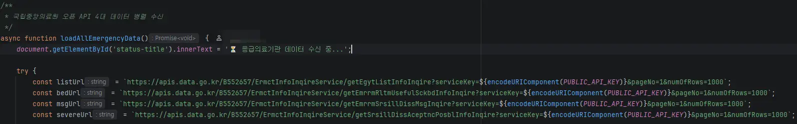
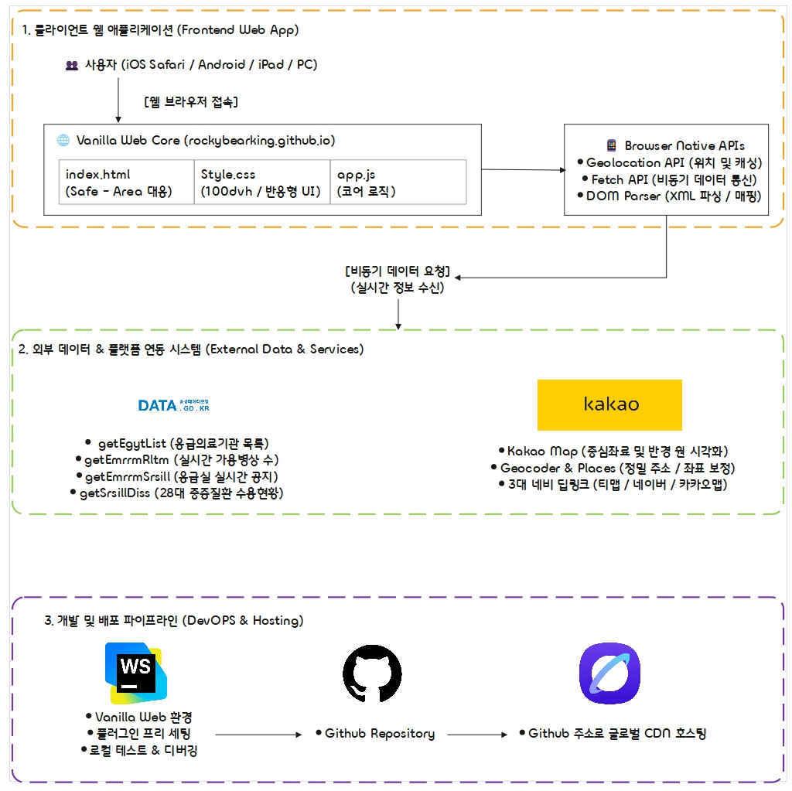

## 융합캡스톤디자인
| [🧑‍🏫 교수] |
| :---: |
| 최병관 |

## 팀 멤버 및 역할
|이름|[🧑‍🎓 김관호(조장)]|[🧑‍🎓 이재원]|[👩‍🎓 장안나]|
|:---:|:---:|:---:|:---:|
|학과|소프트웨어학과|소프트웨어학과|컴퓨터정보통신공학부|
|학번|2021245078|2023245138|2020253074|
|역할| 프론트엔드   UI/UX 개발   | 백엔드   공공데이터API연동   | 데이터 분석   추천 알고리즘 설계|

## 프로젝트 목표
본 과제는 야간 및 공휴일 등 의료 취약 시간대에 발생하는 응급 환자가 진료 가능한 병원을 찾지 못해 골든타임을 놓치는 **'응급실 핑퐁'** 문제를 해결하기 위한 위치 기반 실시간 응급 의료기관 최적 추천 서비스 개발을 목표로 한다.
 &nbsp; 
국립중앙의료원의 응급의료 실시간 공공 API와 지도 API를 연동하여 전국 응급실의 잔여 병상 수, 수술 가능 여부, 전문의 상주 현황 등을 수집한다.
 &nbsp; 
단순히 거리순으로 병원을 나열하는 기존 방식에서 벗어나, [실시간 이동시간 + 현재 잔여 병상 수 + 증상별 처치 가능 여부]를 종합적으로 계산하는 스코어링 알고리즘을 구축하여 환자가 '지금 당장 가장 빠르게 진료받을 수 있는 병원 순위'를 제공한다.
 &nbsp; 
이를 통해 환자 및 보호자의 병원 탐색 시간을 단축하고, 의료기관의 수용 거부로 인한 불상사를 사전에 방지하여 응급 의료 접근성과 편의성을 극대화하고자 한다.

## 과제 시작하기에 앞서 참고한 자료
<a href="https://mediboard.nemc.or.kr/" target="_blank">
  <table>
    <tr>
      <td width="80" align="center">
        
      </td>
      <td>
        <strong>응급의료포털 대시보드 | 중앙응급의료센터</strong> 
        전국 응급실 실시간 가용 병상 현황 및 중증응급의환자 수용 가능 정보를 제공하는 포털입니다. 
        <small>mediboard.nemc.or.kr</small>
      </td>
    </tr>
  </table>
</a>
본 웹사이트는 국립중앙의료원에서 공식적으로 운영 중인 중앙응급의료센터 웹 페이지이다. 서비스 이름은 '내 손안의 응급실'이고 세부사항으로 '응급의료기관', '응급실병상', '입원병상', '중증응급질환', '장비정보' 등. 응급의료환자의 치료를 위한 필수적인 정보를 다루고 있다.
 &nbsp; 
그러나, '내 손안의 응급실'은 단순히 병상의 정보와 가단한 메세지 조회만 가능한 정도이며, 이를 맵 SDK와 연동하여 시각적으로 표현하지 않아 정확한 병원의 위치를 알기가 어려우며 조회할 수 있는 반경도 약 100km 정도 밖에 되지 않는다.

## 과제 수행방법
본 과제는 프론트엔드 웹 기술과 공공데이터 API 연동을 중심으로 단계별로 수행한다.
 &nbsp; 
첫째, 프론트엔드 및 지도 UI 구현 단계에서는 HTML5 Geolocation API를 통해 사용자의 현재 위도·경도 좌표를 정확히 수신하고, 이를 카카오맵 API와 연동하여 지도 위에 현재 위치를 시각화한다. 이후 JavaScript를 활용해 사용자 증상 입력 및 필터링 검색 인터페이스를 동적으로 구현한다. (현재 기초 프로토타입 구현 완료)
 &nbsp; 
둘째, 백엔드 데이터 수집 및 연동 단계에서는 국립중앙의료원 응급의료 공공 API를 수집하여 전국 응급실의 잔여 병상, 수술 가능 여부, 전문의 상주 현황을 실시간으로 파악한다. API 응답 속도 최적화를 위해 Redis 기반 데이터 캐싱 구조를 적용한다.
 &nbsp; 
셋째, 추천 알고리즘 개발 단계에서는 단순히 거리순으로 병원을 나열하는 기존 방식 대신 [실시간 이동시간 + 현재 잔여 병상 수 + 증상별 처치 가능 여부]를 종합 계산하는 스코어링 로직을 개발하여 '최단 시간 내 진료 가능 병원 순위'를 자동으로 도출한다.
 &nbsp; 
마지막으로 통합 테스트 및 검증 단계에서는 모바일 및 PC 브라우저 환경에서 반응형 웹 형태로 동작을 검증하고, 위치 측정 오차 보정 및 서비스 안정성을 최적화하여 과제를 완성한다.
추가로 데이터가 얼마나 최신인지 투명하게 보여주기, 환자가 실제로 겪는 주관적 경험(편의도)와 같은 후기 시스템을 도입하여 정보의 신뢰도와 실사용 가치를 둘 다 잡는다.

## 개발 방향성
프로젝트 초기 개발 환경으로 JetBrains WebStorm을 채택함. VS Code나 Visual Studio와 달리 별도의 복잡한 확장 플러그인 세팅 없이도 완성도 높은 자동 완성과 정적 검사 환경을 즉시 제공하여 초기 구축이 수월했기 때문.
 &nbsp; 
기술 스택은 외부 프레임워크나 라이브러리 의존도를 최소화하고 웹 표준 동작에 집중하기 위해 순수 HTML5, CSS3, 그리고 바닐라 자바스크립트(Vanilla JS)만으로 코어 기능을 구현했습니다.
개조식 (README 기술 스택 / 개발 환경 섹션용)
 &nbsp; 
- 개발 도구 (IDE): JetBrains WebStorm
  - 별도의 플러그인 세팅 없이도 직관적이고 안정적인 개발 환경을 제공하여 VS / VS Code 대비 환경 구성이 용이하다고 판단해 초기 개발 도구로 채택했습니다.
 &nbsp; 
- 기술 스택 (Tech Stack): Vanilla Web
  - HTML5 & CSS3: 반응형 레이아웃 및 디바이스(iOS/안드로이드) 맞춤형 UI 구조 설계
  - Vanilla JavaScript: 프레임워크 없이 브라우저 내장 API(Geolocation, Fetch 등)와 카카오맵 SDK를 직접 핸들링하여 가볍고 빠른 성능 확보

## Initialization

- 카카오디벨로퍼스에 접속하여 JavaScript API KEY 우선적으로 획득
 &nbsp; 

- 국립공공데이터포탈로 접속하여 'XML_국립중앙의료원_전국 병·의원 찾기 서비스' 활용 신청
  - 승인을 받았다면 참고문서(이용_설명서)를 활용하여 프로젝트에 필요한 서비스를 간추려 선택.
  - 전체 서비스는 아래와 같음.   
    <table>
      <tr>
        <th align="center">활용신청 상세기능정보</th>
      </tr>
      <tr>
        <td align="center">응급실 실시간 가용병상정보 조회 /getEmrrmRltmUsefulSckbdInfoInqire</td>
      </tr>
      <tr>
        <td align="center">중증질환자 수용가능정보 조회 /getSrsillDissAceptncPosblInfoInqire</td>
      </tr>
      <tr>
        <td align="center">응급의료기관 목록정보 조회 /getEgytListInfoInqire</td>
      </tr>
      <tr>
        <td align="center">응급의료기관 위치정보 조회 /getEgytLcinfoInqire</td>
      </tr>
      <tr>
        <td align="center">응급의료기관 기본정보 조회 /getEgytBassInfoInqire</td>
      </tr>
      <tr>
        <td align="center">응급의료기관 기본정보 조회 /getEgytBassInfoInqire</td>
      </tr>
      <tr>
        <td align="center">응급의료기관 기본정보 조회 /getEgytBassInfoInqire</td>
      </tr>
      <tr>
        <td align="center">외상센터 목록정보 조회 /getStrmListInfoInqire</td>
      </tr>
      <tr>
        <td align="center">외상센터 위치정보 조회 /getStrmLcinfoInqire</td>
      </tr>
      <tr>
        <td align="center">외상센터 기본정보 조회 /getStrmBassInfoInqire</td>
      </tr>
    <tr>
      <td align="center">응급실 및 중증질환 메시지 조회 /getEmrrmSrsillDissMsgInqire</td>
    </tr>
    </table>
  - 프로젝트에 필요한 서비스는 팀원 간 회의를 통해 최종적으로 9개 중 4개로 결정   
    <table>
      <tr>
        <th align="center">선정 서비스명</th>
        <th align="center">오퍼레이션 명</th>
      </tr>
      <tr>
        <td><b>응급의료기관 목록정보 조회</b></td>
        <td><code>getEgytListInfoInqire</code></td>
      </tr>
      <tr>
        <td><b>응급실 실시간 가용병상정보 조회</b></td>
        <td><code>getEmrrmRltmUsefulSckbdInfoInqire</code></td>
      </tr>
      <tr>
        <td><b>응급실 및 중증질환 메시지 조회</b></td>
        <td><code>getEmrrmSrsillDissMsgInqire</code></td>
      </tr>
      <tr>
        <td><b>중증질환자 수용가능정보 조회</b></td>
        <td><code>getSrsillDissAceptncPosblInfoInqire</code></td>
      </tr>
    </table>  
    

## 시스템 동작 원리

