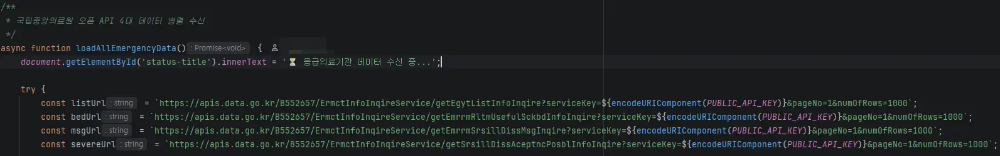
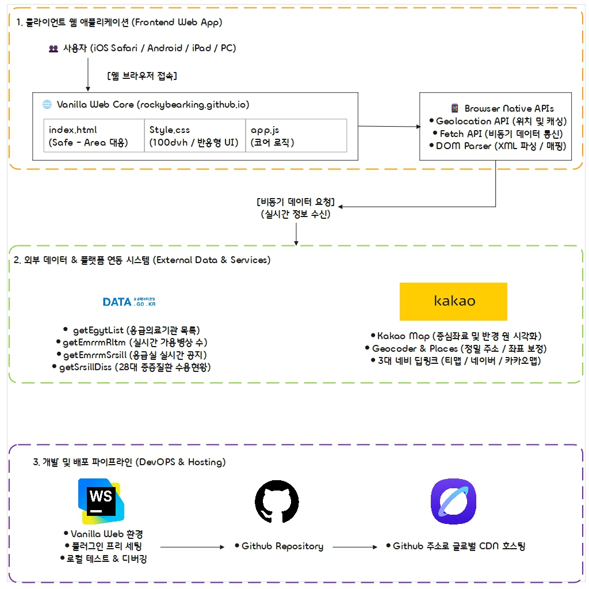
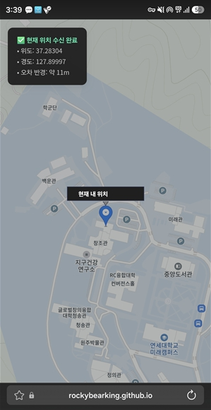
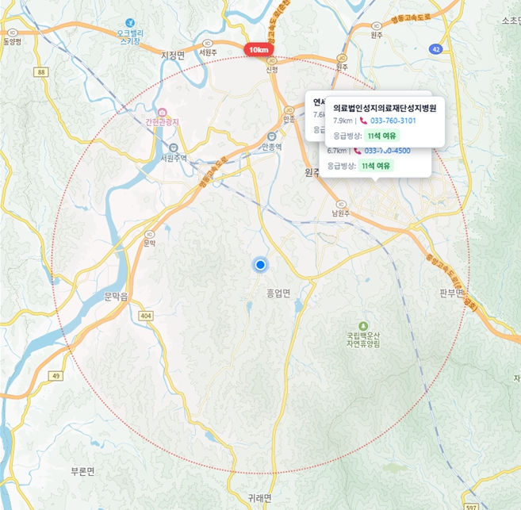
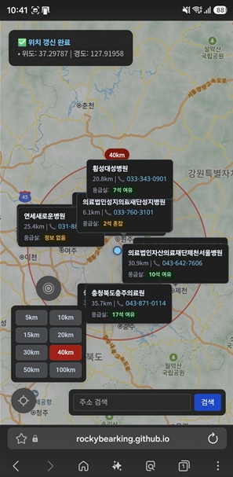
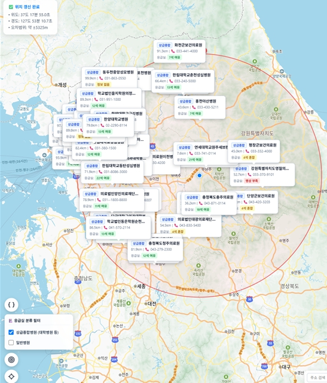
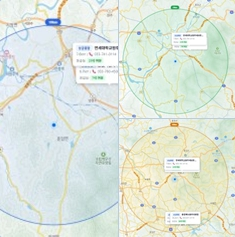
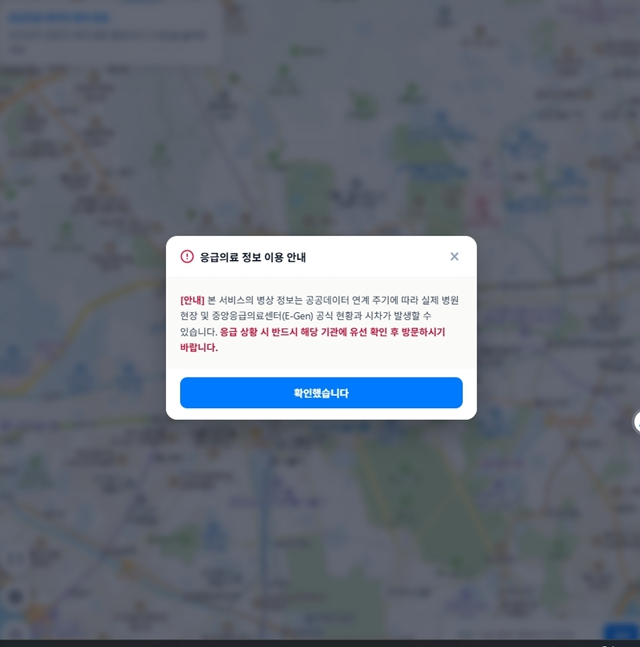
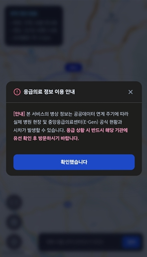
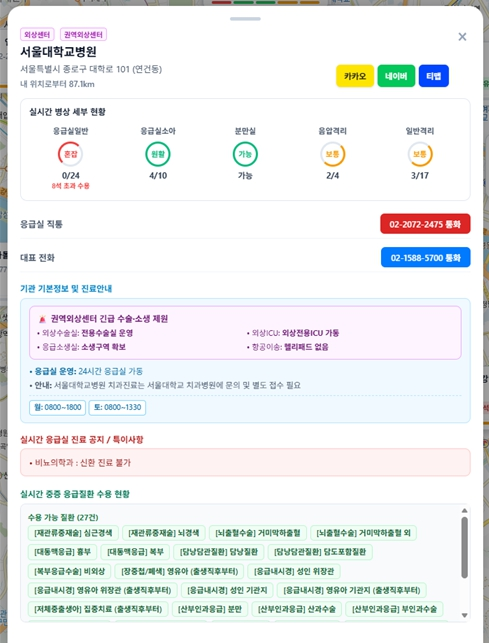

# 융합캡스톤디자인: 응급실 핑퐁 방지를 위한 위치 기반 실시간 응급의료 최적 추천 서비스

## 지도교수
| 교수명 | 소속 / 직함 |
| :---: | :---: |
| **최병관** | 교수 |

## 팀 구성원 및 역할 (팀명: 닥터피쉬)

| 이름 | 학과 | 학번 | 담당 역할 |
| :---: | :---: | :---: | :--- |
| **김관호 (팀장)** | 소프트웨어학과 | 2021245078 | • 프론트엔드 개발 • UI/UX 설계 및 인터페이스 구현 |
| **이재원** | 소프트웨어학과 | 2023245138 | • 백엔드 인프라 구축 • 국립중앙의료원 공공데이터 API 연동 및 Redis 캐싱 |
| **장안나** | 컴퓨터정보통신공학부 | 2020253074 | • 데이터 파이프라인 분석 • 다차원 가중치 기반 응급실 최적 추천 알고리즘 설계 |

## 프로젝트 목표
본 과제는 야간 및 공휴일 등 의료 취약 시간대에 발생하는 응급 환자가 진료 가능한 병원을 찾지 못해 골든타임을 놓치는 **'응급실 핑퐁(재이송)'** 문제를 해결하기 위한 **위치 기반 실시간 응급 의료기관 최적 추천 서비스** 개발을 목표로 합니다.

국립중앙의료원의 응급의료 실시간 공공 API와 웹 지도 API를 연동하여 전국 응급실의 잔여 병상 수, 실시간 중증 질환 수술 가능 여부, 전문의 상주 현황 등을 집계합니다.

단순히 물리적 거리순으로 병원을 나열하는 기존 방식에서 벗어나, **[실시간 이동시간 + 현재 잔여 병상 수 + 증상별 처치 가능 여부]**를 종합적으로 연산하는 다차원 스코어링 알고리즘을 구축하여 환자가 지금 당장 가장 신속하게 처치받을 수 있는 병원 순위를 제공합니다.

이를 통해 환자 및 보호자의 병원 탐색 시간을 최소화하고, 수용 불가로 인한 전원 사태를 사전에 방지하여 응급 의료 접근성과 편의성을 극대화합니다.

## 선행 벤치마킹 및 분석

  
   
  <strong><a href="https://mediboard.nemc.or.kr/" target="_blank">응급의료포털 대시보드 | 중앙응급의료센터 (내 손안의 응급실)</a></strong>
  
전국 응급실 실시간 가용 병상 현황 및 중증 응급환자 수용 가능 정보를 제공하는 공식 대시보드

국립중앙의료원에서 운영하는 공식 포털은 응급의료기관, 병상 현황, 중증응급질환 처치 정보 등 필수 데이터를 종합적으로 다루고 있습니다.

그러나 지도 SDK와의 유기적인 시각화 연계가 부족하여 직관적인 위치 파악이 어렵고, 조회 반경 제한(약 100km) 및 단순 상태값 나열 방식에 머물러 있어 이동 시간과 환자의 급박한 상황을 고려한 동적 우선순위 추천에는 한계가 존재합니다.

## 과제 수행 방법

1. **프론트엔드 및 지도 UI 구현**
- HTML5 Geolocation API를 통해 사용자의 현재 위도·경도 좌표를 정밀 수신하고, 카카오맵 SDK와 연동하여 현 위치 중심의 클러스터링 및 시각화를 수행합니다.
- 사용자 증상 선택 및 필터링 검색 인터페이스를 직관적인 반응형 컴포넌트로 구현합니다.
2. **백엔드 데이터 수집 및 연동**
- 국립중앙의료원 공공데이터 Open API를 연계하여 가용 병상, 중증질환 수용 가능 여부, 공지 메시지를 실시간 파이프라인으로 처리합니다.
- API 응답 병목 현상을 해소하고 공공 API 호출 제한을 방어하기 위해 **Redis 기반 인메모리 캐싱 계층**을 설계합니다.
3. **추천 알고리즘 개발**
- `실시간 이동 소요시간`, `가용 병상 가중치`, `증상별 의료진/장비 처치 가능 지수`를 통합 산출하는 휴리스틱 스코어링 모델을 구현하여 '최적 진료 가능 병원 랭킹'을 도출합니다.
4. **통합 테스트 및 검증**
- 모바일 및 데스크톱 뷰포트를 모두 수용하는 반응형 인터페이스를 검증합니다.
- 데이터 수신 타임스탬프를 명시하여 정보 투명성을 보장하고, 이용자 피드백 기반의 실시간 병원 접근 편의도 피드백 구조를 도입합니다.

## 기술 스택 및 개발 환경

- **개발 도구 (IDE):** JetBrains WebStorm
  - 별도의 플러그인 세팅 없이도 직관적이고 안정적인 자바스크립트 자동 완성 및 정적 검사 환경을 제공하여 채택
- **프론트엔드 (Core Tech):** Vanilla Web Standards
  - `HTML5 / CSS3`: 디바이스(iOS / Android / Desktop) 맞춤형 반응형 레이아웃 및 컴포넌트 스타일링
  - `Vanilla JavaScript (ES6+)`: 외부 프레임워크 오버헤드를 배제하고 브라우저 네이티브 API(Geolocation, Fetch)와 지도 SDK를 직접 제어하여 경량화 및 실행 속도 극대화

## 시스템 아키텍처 및 API 연동

### 1. 외부 API 인프라 구성

  
  &nbsp;&nbsp;&nbsp;&nbsp;
  
   
  ▲ 카카오 지도 SDK 연동 및 공공데이터포털 Open API 활용 인프라

### 2. 국립중앙의료원 API 오퍼레이션 채택

공공데이터포털 `국립중앙의료원_전국 응급의료기관 정보 조회 서비스` 전체 오퍼레이션 중 서비스 코어에 필요한 4개 핵심 엔드포인트를 선별하여 연동했습니다.

| 오퍼레이션 명 | 서비스 상세 기능 | 활용 목적 |
| :--- | :--- | :--- |
| `getEgytListInfoInqire` | **응급의료기관 목록정보 조회** | 전국 응급의료기관 기본 마스터 데이터 및 식별 ID 확보 |
| `getEmrrmRltmUsefulSckbdInfoInqire` | **응급실 실시간 가용병상정보 조회** | 일반/중환자실/격리병상 잔여 현황 실시간 집계 |
| `getEmrrmSrsillDissMsgInqire` | **응급실 및 중증질환 메시지 조회** | 의료기관별 진료 제한, 응급실 폐쇄, 실시간 특이사항 수신 |
| `getSrsillDissAceptncPosblInfoInqire` | **중증질환자 수용가능정보 조회** | 뇌출혈, 심근경색 등 중증 응급질환별 수술/처치 가능 여부 판별 |

  
   
  ▲ 프로젝트 핵심 연동 API 파이프라인

### 3. 시스템 동작 원리

  
   
  ▲ 데이터 파이프라인 및 추천 랭킹 연산 흐름도

## 프로젝트 타임라인

### 2026.09.08
- **최초 아이디어 브레인스토밍**
  - 김관호: 위치 기반 공공데이터 연계 야간/공휴일 응급실 실시간 가용 병상 안내 서비스 제안
  - 이재원: 흉부 X-Ray 데이터셋 기반 폐렴 및 호흡기 질환 감지 AI 모델 제안
  - 장안나: 웹캠 모션 트래킹 기반 체형 불균형(척추·경추 각도) 진단 서비스 제안
- **최종 주제 확정:** 사회적 문제 해결 시급성과 실시간 데이터 연계 가치가 높은 '위치 기반 응급실 최적 추천 서비스' 선정 (팀명: **닥터피쉬**)

### 2026.09.09
- **플랫폼 아키텍처 결정**
  - 네이티브 앱 개발 시 요구되는 멀티 플랫폼(OS별) 빌드 종속성 및 장비 제약을 고려하여, 범용적 웹 브라우저 기반으로 접근성을 극대화하기로 결정
  - IDE로 정적 분석 및 웹 표준 개발 효율이 높은 JetBrains WebStorm 확정

### 2026.09.10
- **기술 스택 분장 및 역할 배분**
  - 김관호: HTML5/CSS3 레이아웃 설계, API 비동기 수신 모듈 설계
  - 이재원: 공공데이터 및 카카오 SDK 인증 키 발급, 바닐라 자바스크립트 기반 지도 인터랙션 구현
  - 장안나: 타깃 API 명세서 분석, E-Gen 벤치마킹, UI 컴포넌트 스타일링

### 2026.09.15

  
   
  ▲ 최초 프로토타입 뷰포트 연동 화면

- **도출된 개선점**
  - 응급실 분류(중증/일반/소아 등) 세부 필터 체계 필요
  - 사용자 중심의 동적 탐색 반경(Circle Overlay) 시각화 필요
  - GPS 오차 대응을 위한 '현 위치 재탐색' 수동 트리거 버튼 추가

### 2026.09.18

  
  &nbsp;
  
   
  ▲ (좌) PC / 웹 뷰 화면 &nbsp;|&nbsp; ▲ (우) 모바일 반응형 뷰

- **도출된 개선점**
  - 중증질환자 수용 가능 정보 및 실시간 병원 메시지 API 파이프라인 추가 연동 필요
  - 밀집 구역 내 병원 마커 오버레이 중첩(클러스터링) 가독성 이슈 해결 필요
  - 의료기관 종별(상급종합병원 / 2차 종합병원 / 1차 의료기관) 식별 UI 분류 체계 확립

### 2026.09.21
- **팀 내부 1차 기능 시연 및 중간 점검 완료**

### 2026.09.28

  
  &nbsp;
  
   
  ▲ (좌) 병원 분류 필터 화면 &nbsp;|&nbsp; ▲ (우) 거리/상태별 반경 색상 화면

- **추가 고도화 사항**
  - 밀집 구역 마커 오버랩 방지를 위한 시각적 계층화 완료
  - 응급 이동 편의성을 위한 주요 3사 내비게이션(카카오내비, 네이버지도, TMAP) 딥링크 바로가기 액션 연동

### 2026.10.01
- **GitHub Repository 명칭 변경**
  - 프로젝트의 정체성과 서비스 목적을 직관적으로 드러내기 위해 저장소 이름 변경 합의 및 적용 (`Gpt-proj` → `yonsei119`)

### 2026.10.02

  
  &nbsp;
  
   
  ▲ (좌) 면책 조항 모달 PC 뷰 &nbsp;|&nbsp; ▲ (우) 면책 조항 모달 모바일 반응형 뷰

- **면책 조항 및 법적 고지 UI 추가**
  - 공공데이터 연계 시차에 따른 현장 혼선 방지 및 서비스 신뢰도/법적 안정성 확보를 위한 안내 팝업 구현
  > **[이용 안내 및 법적 고지]**  
  > 본 서비스에서 제공하는 병상 및 진료 현황은 공공데이터 연계 주기에 따라 실제 병원 현장 및 중앙응급의료센터(E-Gen) 공식 현황과 시차가 발생할 수 있습니다. 응급 상황 시 반드시 서비스 내 전화 연결 버튼을 통해 해당 의료기관의 수용 가능 여부를 유선 확인 후 이동하시기 바랍니다.

### 2026.10.06

  
   
  ▲ 권역외상센터 전용 뷰 및 세부 정보 연동 화면

- **권역외상센터(Regional Trauma Center) 데이터 및 UI 연동**
  - 다발성 중증 외상 환자의 신속한 이송 및 골든타임 확보를 위해 일반 응급의료기관과 구분되는 권역외상센터 전용 필터 및 식별 마커 추가
  - 전문 치료 자원(외상소생실, 전용 중환자실 등) 보유 기관 중심의 직관적 우선 탐색 체계 마련
- **도출된 개선점**
  - 주요 3사 내비게이션(카카오맵, 네이버지도, T맵) 지원 방식 및 연동 안정성 추가 개선
  - 실시간 세부 자원(일반 병상 / 수술실 / 중환자실 / 입원실 / 추가 격리실) 가용 정보 파이프라인 추가 개선
  - 보고시각 추가 필요 (값의 객관화 및 데이터 최신성 검증을 위해 필수)
  - API 호출/수신 데이터의 무결성 검증 및 디버깅을 위한 '개발자 모드' 추가 필요

## 기술적 한계점 및 대응 전략

본 프로젝트는 공공데이터포털의 Open API(`국립중앙의료원_전국 응급의료기관 정보 조회 서비스`)를 기반으로 병상 데이터를 수신합니다. 공식 대국민 서비스인 **중앙응급의료센터(E-Gen)** 포털과의 인프라 차이로 인해 다음과 같은 기술적 제약이 수반됩니다.

### 1. 망 분리 및 캐싱 구조로 인한 동기화 시차 (Time-Lag)
- **E-Gen (공식 망):** 의료기관이 국가 응급의료 전산망인 **'중앙응급의료상황판(K-응급상황정보)'** 내부망에 입력한 데이터가 직접 실시간 반영되는 인프라입니다.
- **공공데이터 Open API:** 정부 내부망 보안(망 분리) 정책 및 트래픽 부하 분산을 위해 운영 DB 직접 질의가 차단되며, 공공데이터 연계 서버의 배치(Batch) 주기 및 캐시 계층을 거쳐 비동기로 미러링됩니다.
- **현상 및 영향:** 공식 포털 대비 수 분에서 십수 분 단위의 갱신 시차가 상시 발생합니다. 환자 입·퇴원 및 응급 이송이 분 단위로 교차하는 응급실 특성상 일시적인 수치 차이가 발생할 수 있습니다.

### 2. 특정 데이터 Null 값 및 집계 기준 불일치
- **특수 병상 데이터 누락:** API 명세(XML Schema)상 코호트 격리 등 특수 병상 필드(`hv42` 등)가 정의되어 있으나, 실제 연계 파이프라인에서 값이 유실되어 `null` 또는 빈 태그로 송출되는 결측치가 존재합니다.
- **병상 집계 모수 차이:**
  - `E-Gen 포털`: 원내 입원 격리병동 및 권역외상센터 가용 병상을 통합 집계하여 표출하는 기준을 사용합니다.
  - `Open API`: 응급실(ER) 구역 내부 격리실만을 기준으로 수집합니다.
  - 동일 의료기관이라도 기준 총 병상(분모)과 가용 병상(분자) 수치에 산출 편차가 존재할 수 있습니다.

### 3. 극복 및 대응 전략
- **데이터 신뢰도 중심의 UI 재구성:** 결측 빈도가 높은 '코호트 격리' 등의 필드 노출을 지양하고, 수신 정확성이 높은 '일반 응급실 가용 병상' 지표를 중심으로 인터페이스를 재구성했습니다.
- **투명한 면책 고지 및 원클릭 유선 확인 제공:** 공공망 연계 지연은 클라이언트단에서 원천 해결이 불가능하므로, 화면 내 데이터 수신 타임스탬프와 안내문을 투명하게 명시하고, 병원 대표번호로 즉시 연결되는 전화 발신 CTA(Call-to-Action) 버튼을 배치했습니다.

> **[이용 안내 및 법적 고지]**  
> 본 서비스에서 제공하는 병상 및 진료 현황은 공공데이터 연계 주기에 따라 실제 병원 현장 및 중앙응급의료센터(E-Gen) 공식 현황과 시차가 발생할 수 있습니다. 응급 상황 시 반드시 서비스 내 전화 연결 버튼을 통해 해당 의료기관의 수용 가능 여부를 유선 확인 후 이동하시기 바랍니다.